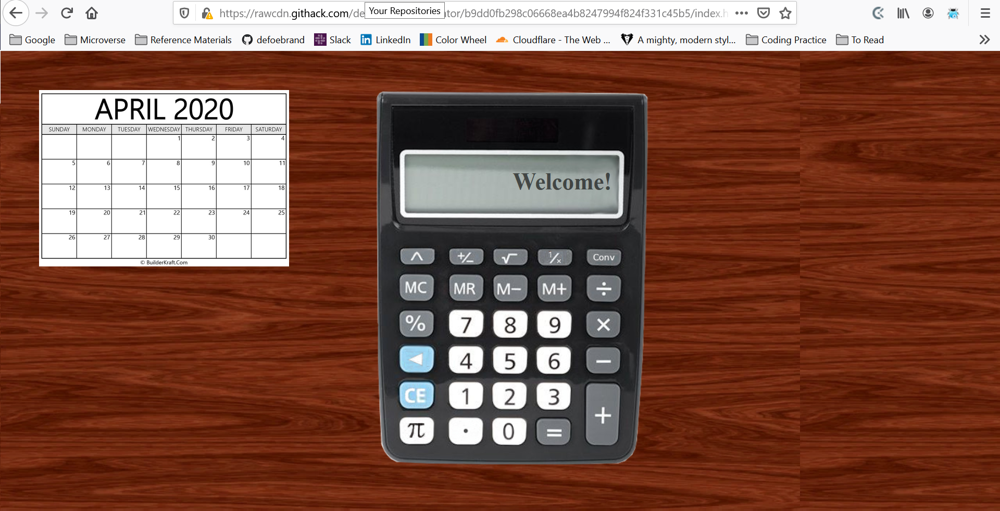

# Project Name

Microverse Pre-course work Calculator

Additional description about the project and its features.

This project was the final project compiled by Brandon during the Microverse Pre-course work

## Built With

- HTML, CSS, and JS
- Atom
- Ubuntu

## Live Demo

[Live Demo Link](https://rawcdn.githack.com/defoebrand/Calculator/b9dd0fb298c06668ea4b8247994f824f331c45b5/index.html)

## Getting Started

To get your own copy of our project clone the repository to your local machine.

## Authors

👤 **Brandon Defoe**

- Github: [@defoebrand](https://github.com/defoebrand)
- Gmail: [defoebrand](defoe.brand@gmail.com)

## 🤝 Contributing

Contributions, issues and feature requests are welcome!

Feel free to check the [issues page](issues/).

## Show your support

Give a ⭐️ if you like this project!

## Future features
(may include but are not limited to)
- measurement convertor
- interactive calendar

## 📝 License

This project is licensed by Microverse and The Odin Project
